 # 星选购物平台mall_gin

这是一个基于Gin框架、GORM、MySQL数据库，并使用Redis作为缓存中间件开发的个人项目。主要尝试快速上手常用中间件，因此重心不在前端界面。

## 功能特性

- 用户注册/登录功能
- 用户个人信息修改
- 商城主页
- 热搜商品（基于redis）
- 商品搜索
- 购物车管理
- 订单处理
- JWT安全认证管理


## 技术栈

- **后端**: Go语言, Gin框架
- **数据库**: MySQL, 通过GORM进行操作
- **缓存**: Redis


## 项目架构

### 目录结构

本项目采用了清晰的分层架构设计，确保代码易于理解和维护。以下是主要的目录结构和组件：


```
mall_gin/
├── assets/
│   ├── css/
│   ├── images/
│   └── js/
├── internal/
│   ├── database/               # 数据库相关操作
│   ├── handlers/               # 路由和控制器
│   ├── models/                 # 数据模型定义
│   ├── redis/                  # Redis相关操作
│   └── services/               # 业务逻辑层
├── routers/                    # 路由配置
│   └── setup_router.go         # 路由设置文件
├── templates/                  # 模板文件
├── API.md                      # API文档
├── go.mod                      # Go模块管理文件
├── go.sum                      # Go模块校验文件
├── main.go                     # 主入口文件
└── mall_gin.sql                # 数据库初始化脚本
```

### 架构概述

1. **入口文件 (`main.go`)**:
    - 程序的启动点，负责初始化应用配置、数据库连接、Redis客户端等，并启动HTTP服务器。

2. **Handler (路由和控制器)**:
    - 定义所有API端点及其对应的处理函数。
    - 使用Gin框架来简化HTTP请求的处理。
    - 绝大部分的服务层也在控制器中实现。

3. **Model (数据模型)**:
    - 定义与数据库表对应的Go结构体。
    - 使用GORM进行ORM操作，简化数据库交互。


5. **Service (业务逻辑层)**:
    - 提供JWT与加解密服务


10. **文档 (`API.md`)**:
    - 提供部分后端接口API说明。


### 数据库设计
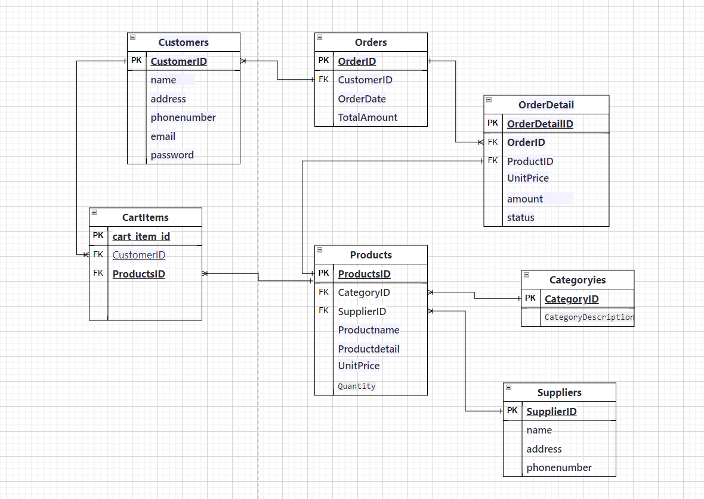

## 安装指南

### 前置条件

确保环境中已安装以下软件：

- Go (1.15+)
- MySQL (5.7+)
- Redis (5.0+)

### 获取代码

```bash
git clone https://github.com/SeaCloudw/mall_gin.git
```


### 建立数据库

执行以下命令：
默认库名为mall_gin

```bash
source ./mall_gin.sql
```
### 配置环境
配置Redis,
在文件internal/redis/client.go
redishost需要填写Redis服务器地址
```go
func InitRedis() {

    redishost:="192.168.123.1:6379"
	globalClient = NewClient(redishost, "", 0)
	if err := globalClient.Ping(ctx).Err(); err != nil { 
		log.Fatalf("cannot connect to redis: %v", err)
	}
	log.Println("success connect Redis")
}
```

配置数据库
internal/database/init.go
dsn填写“用户名：密码@tcp(mysql服务器地址：端口号)/mall_gin”

```go
func InitDB() {
	dsn := "root:root@tcp(127.0.0.1:3306)/mall_gin?charset=utf8mb4&parseTime=True&loc=Local"
	var err error
	db, err = gorm.Open(mysql.Open(dsn), &gorm.Config{})
	if err != nil {
		panic("无法连接数据库")
	}
}
``` 

### 启动服务
```bash
go build
```
需要哪些库就输入
```
go get
```


```bash
go run main.go
```

默认情况下，服务器将在 `http://localhost:8080` 上运行。

## 功能详细说明 

### 用户注册/登录功能
提供用户注册和登录功能。注册时须填写邮箱。

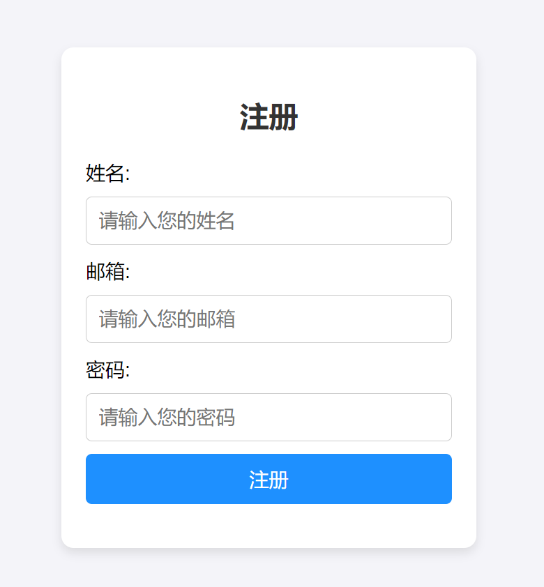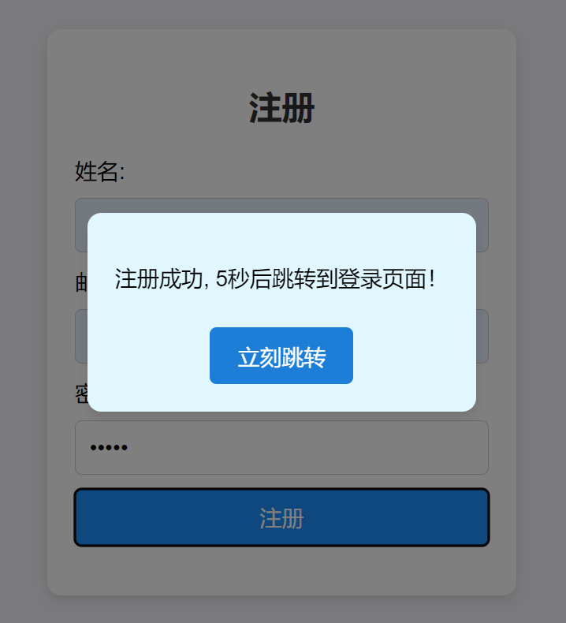

登录成功时后端提供token,并将保存到本地缓存中。

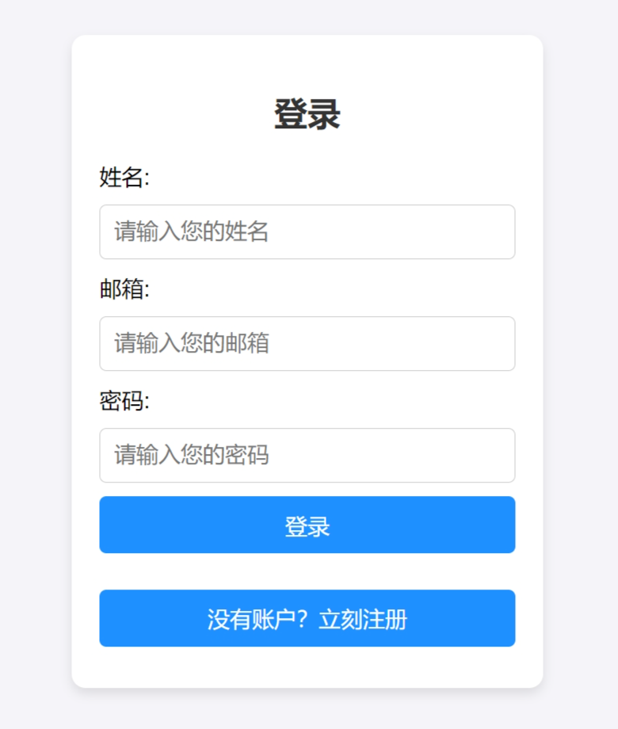


### 用户个人信息修改
用户登录后需要补全地址信息，同时允许修改他们的个人信息，包括昵称、邮箱、联系方式等。保证用户能够轻松管理自己的账户信息。

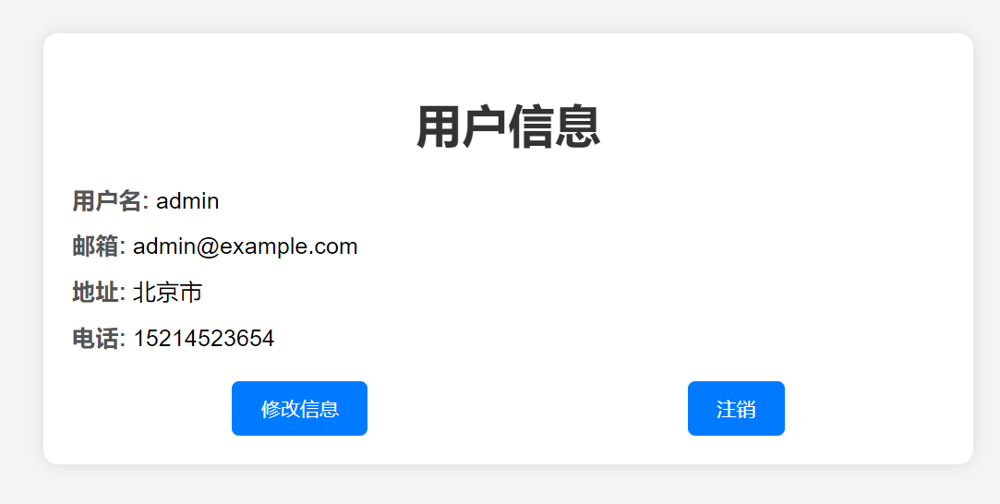

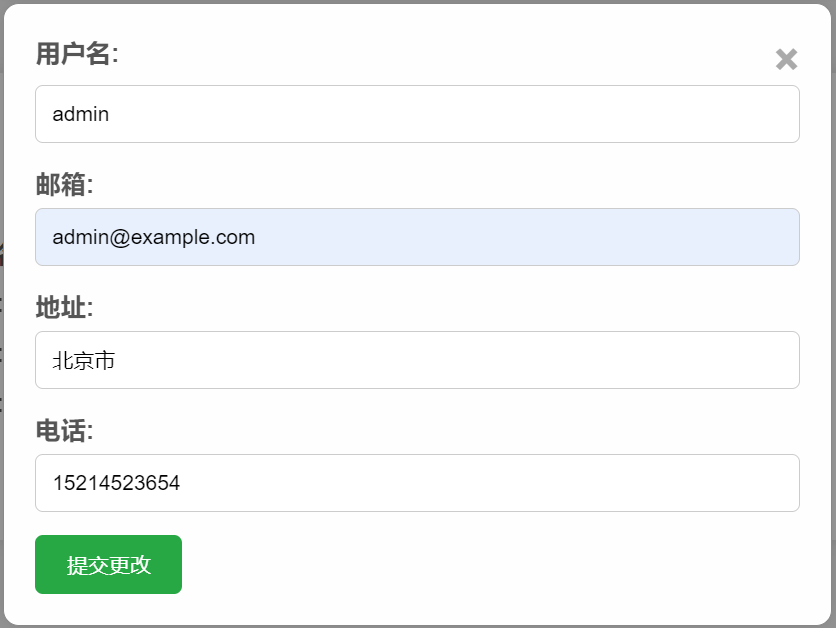

### 商城主页
展示商城的主要商品,每个商品单独一行，均支持直接加入购物车与直接下单；
点击商品将跳转都按商品详情界面

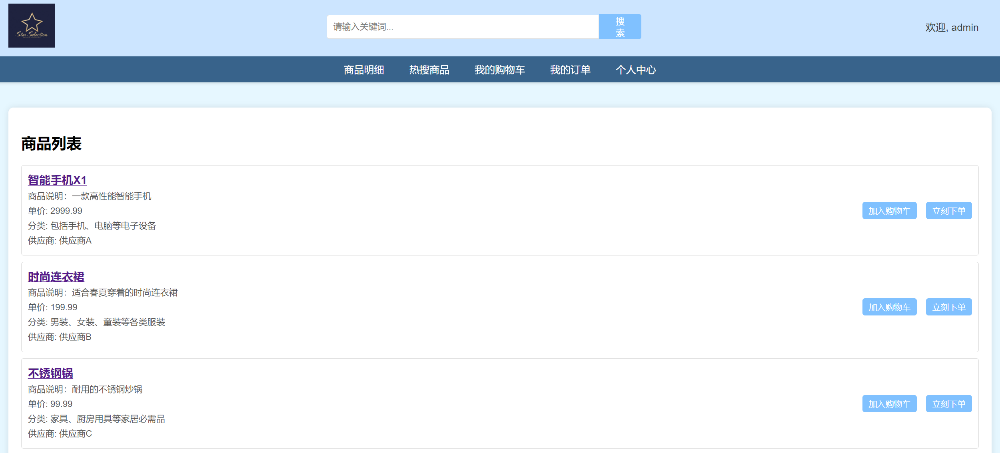
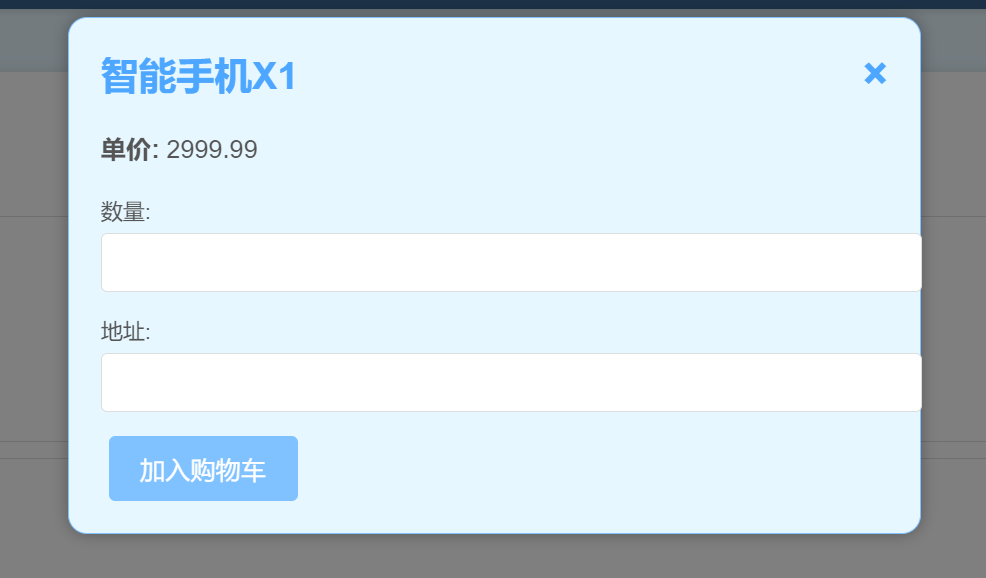
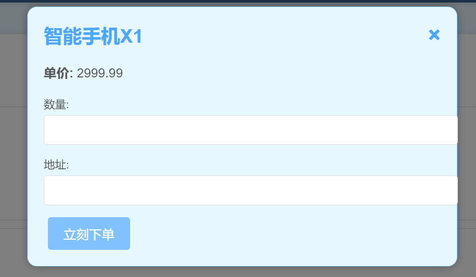
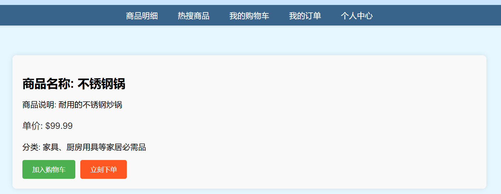


### 热搜商品（基于Redis）
利用Redis存储和计算热门搜索的商品，实时更新并显示在热搜商品的界面（默认5条）上，帮助用户快速找到流行商品。

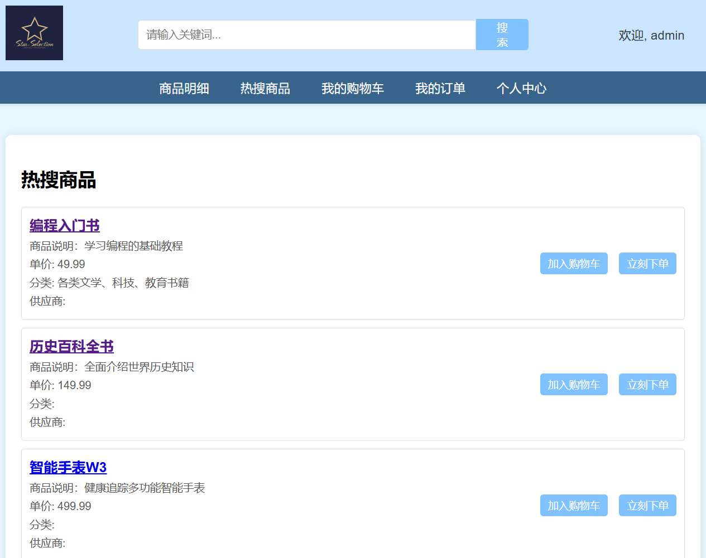

### 商品搜索
提供商品搜索功能，支持关键词模糊搜索。

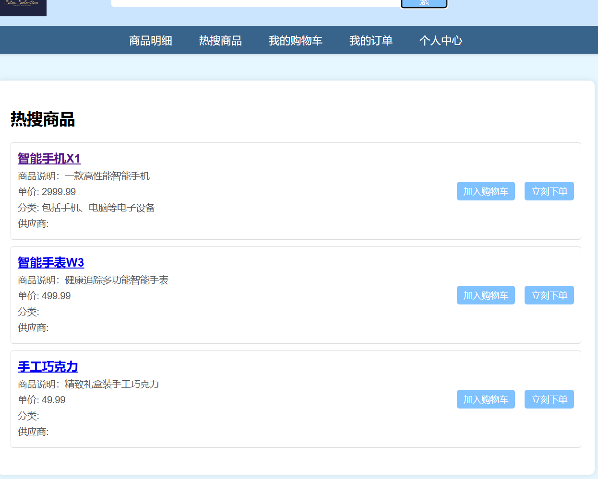
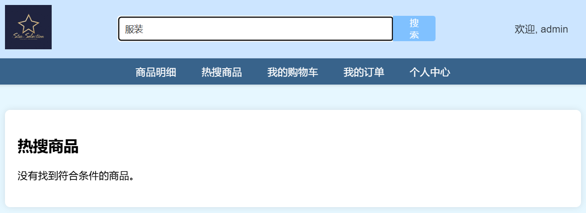


### 购物车管理
用户可以将心仪的商品添加到购物车，并随时查看或下单购物车中的商品。

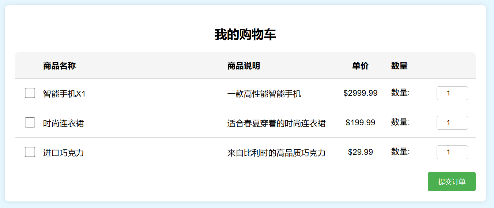

### 查看订单

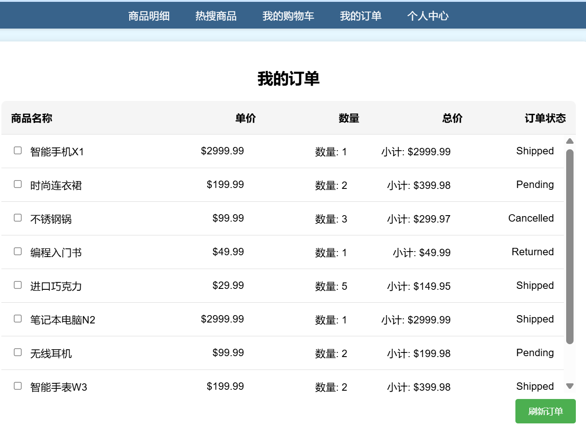


## 测试

提供测试案例或指导如何运行测试用例。

## 贡献者


## 版权与许可


